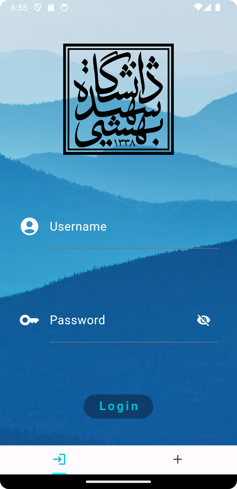
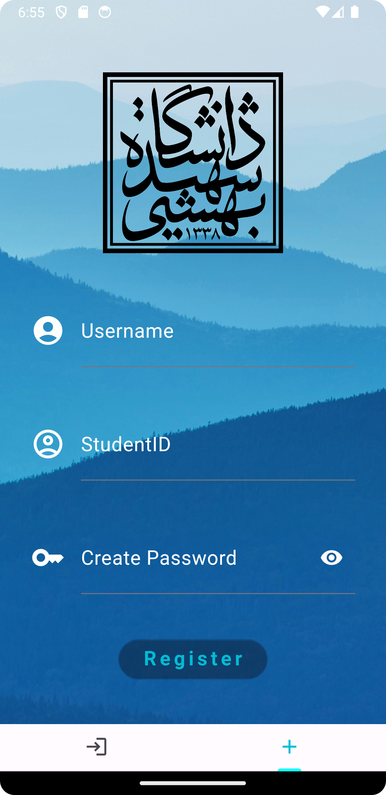
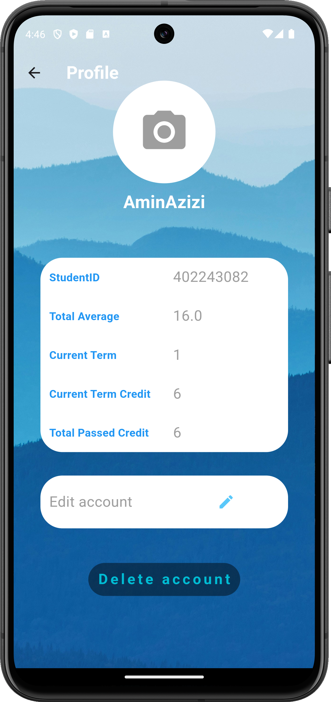
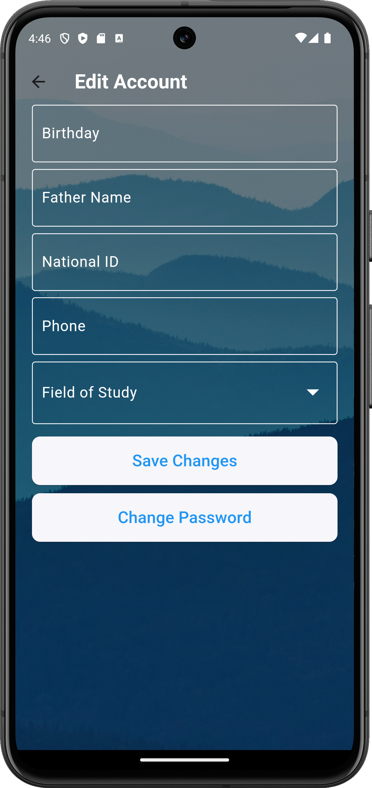

---

# Sistema de Gestión Universitaria (دانشجویار)

- Esta aplicación se desarrolló en la primavera de 2024 (aproximadamente 1403 en el calendario persa).

## Descripción
Este proyecto es un sistema integral para la gestión universitaria, que ofrece funciones como la gestión de estudiantes y profesores, consulta de estados académicos, inscripción a clases, visualización de fechas límite y noticias universitarias.

## Instalación y Configuración
Para instalar y configurar el proyecto, sigue estos pasos:
1. Asegúrate de tener JDK y Android Studio instalados en tu sistema.
2. Clona el código fuente:
   ```
   git clone https://github.com/AloofAli/danshjoyar-flutter.git
   ```
3. Abre el proyecto en Android Studio.
4. Ejecuta el proyecto en el emulador o en tu dispositivo físico.

## Estructura del Proyecto
El proyecto consta de dos secciones principales:
- **CLI**: La sección de interfaz de línea de comandos para la gestión universitaria usando Java.
- **Aplicación**: La sección de la aplicación móvil usando el framework Flutter.

```
daneshjoyar_flutter/
├── lib/
│   ├── main.dart                
│   ├── DaneshjoyarApp.dart      
│   ├── pages/                    
│   │   ├── saraPage.dart            
│   │   ├── tamrina.dart        
│   │   ├── khabaraPage.dart         
│   │   ├── classaPage.dart         
│   │   └── karapage.dart
│   ├── NewsHandling/            
│   ├── asset/                  
│   ├── Main/                   
│   └── ...
```

## Uso
1. Regístrate e inicia sesión como estudiante o miembro del profesorado.
2. Consulta estados académicos, clases inscritas, fechas límite y noticias universitarias.
3. Como miembro del profesorado, consulta los estados de los estudiantes en tus clases y asigna tareas o proyectos.

## Agradecimientos
Este proyecto utiliza código y recursos que pertenecen a terceros. Respeta los permisos correspondientes.

---

## Páginas de la Aplicación

### 1. Inicio de Sesión y Registro

- **Descripción**: Los usuarios pueden iniciar sesión en cuentas existentes o registrarse para crear nuevas.
- **Funcionalidad**: Gestiona la autenticación y administra las sesiones de usuario.

---

### Resumen de `LoginPage`


#### Importaciones
El código de `LoginPage` importa las bibliotecas y dependencias necesarias para el diseño de UI en Flutter, la red y las notificaciones toast.

#### Clase: `LoginPage`

**Widget con Estado**
- `LoginPage` gestiona el estado de la página de inicio de sesión, manejando la entrada del usuario y la autenticación.

**Clase de Estado: `_LoginPageState`**
- Gestiona la visibilidad del campo de contraseña (`_passwordVisible`) y el estado de inicio de sesión (`userCanLogin`).

**Inicialización (`initState()`)**
- Inicializa `_passwordVisible` en `false` al crear el widget.

**Método Build (`build(BuildContext context)`)**
- Construye la interfaz de usuario usando `Scaffold`, `Container`, una imagen de fondo y el logotipo de la universidad.
- Incluye widgets `TextField` para los campos de usuario y contraseña, con un interruptor de visibilidad de contraseña.
- Implementa `ElevatedButton` para el inicio de sesión, que activa la función `loginChecker` al presionarse.

**Controladores de Edición de Texto**
- Gestiona `usernameController` y `passwordController` para las entradas de texto.

**Liberación (`dispose()`)**
- Libera recursos eliminando `usernameController` y `passwordController`.

**Función `loginChecker` (`Future<bool> loginChecker(String username, String password)`)**
- Se conecta a la dirección IP especificada (`172.28.0.1`) y puerto (`7777`), y envía la solicitud de inicio de sesión (`'LOGIN~$userData\u0000'`).
- Escucha la respuesta del servidor y completa el `Completer` basándose en el éxito (`true`) o el fallo (`false`).

**Función `error`**
- Muestra una notificación toast (`Toastification`) en caso de fallo de inicio de sesión por credenciales inválidas.

### Uso
- `LoginPage` sirve como punto de entrada para la aplicación de gestión universitaria.
- Tras un inicio de sesión exitoso, navega a los usuarios a `mainPageHandler` para continuar la interacción.

### Notas Adicionales
- Asume la existencia de autenticación en el servidor (`loginChecker`).
- Proporciona retroalimentación al usuario mediante notificaciones toast para el manejo de errores.

---

### 2. Registro


#### Resumen de `SignUpPage`

**Importaciones**
- Importa bibliotecas para el diseño de UI en Flutter, la red y las notificaciones toast.

**Widget con Estado: `SignUpPage`**
- Gestiona el estado para el registro de usuarios, manejando la entrada y la validación.

**Clase de Estado: `_SignUpPageState`**
- Gestiona la visibilidad del campo de contraseña (`_passwordVisible`), el estado de validación (`_isValid`) y los mensajes de error (`_errorMessage`).

**Inicialización (`initState()`)**
- Inicializa `_passwordVisible` en `false` al crear el widget.

**Método Build (`build(BuildContext context)`)**
- Construye la interfaz de usuario usando `Scaffold`, `Container`, una imagen de fondo y el logotipo de la universidad.
- Incluye widgets `TextFormField` para los campos de usuario, matrícula y contraseña, con un interruptor de visibilidad de contraseña.
- Implementa `ElevatedButton` para el registro, que activa la función `signupChecker` al presionarse después de validar la contraseña.

**Controladores de Edición de Texto**
- Gestiona `usernameController`, `studentIDController` y `passwordController` para las entradas de texto.

**Liberación (`dispose()`)**
- Libera recursos eliminando los controladores de edición de texto.

**Función `_validatePassword` (`bool _validatePassword(String password)`)**
- Valida los criterios de la contraseña (longitud, mayúsculas, minúsculas, dígitos, carácter especial).
- Muestra mensajes de error mediante la función `error()` en caso de fallos de validación.

**Función `error`**
- Muestra una notificación toast (`Toastification`) en caso de fallo en la validación de la contraseña.

**Función `error_username_signup`**
- Muestra una notificación toast (`Toastification`) para nombres de usuario o matrículas duplicados durante el registro.

**Función `signupChecker` (`Future<bool> signupChecker(String username, String studentID, String password)`)**
- Se conecta a la dirección IP especificada (`172.28.0.1`) y puerto (`7777`), y envía la solicitud de registro (`'SIGNUP~$userData\u0000'`).
- Escucha la respuesta del servidor y completa el `Completer` basándose en el éxito (`true`) o el fallo (`false`).

#### Uso
- `SignUpPage` permite a los nuevos usuarios registrarse en la aplicación de gestión universitaria.
- Tras un registro exitoso, navega a los usuarios a `mainPageHandler` para continuar la interacción.

#### Notas Adicionales
- Asume la existencia de registro en el servidor (`signupChecker`).
- Proporciona un manejo de errores amigable para el usuario mediante notificaciones toast (`error()` y `error_username_signup()`).

---

### 3. Perfil de Usuario

#### Clase `profileScreen`

**Estructura de la Clase e Importaciones**
- Importa bibliotecas esenciales para el diseño de UI y la funcionalidad en Flutter.
- Define `profileScreen` como un widget con estado que gestiona la información del perfil del usuario.

**Gestión de Estado (`_profileScreenState`)**
- Inicializa los datos del usuario usando `initDatas()` al crear el widget.
- Gestiona la interfaz de usuario con `Scaffold`, `AppBar`, `Stack`, `SingleChildScrollView` y diversos widgets de diseño.
- Muestra `username`, `studentID`, `totalAverage`, `currentTerm`, `currentTermCredit` y `totalPassedCredit` obtenidos del servidor mediante `initDatas()`.

**Red (Métodos `initDatas()` y `deleteAccount()`)**
- Se conecta al servidor para obtener los datos del perfil del usuario (`PROFILE~$userData\u0000`).
- Elimina la cuenta del usuario tras la confirmación mediante `DELETEACCOUNT~$un\u0000`.

**Elementos de UI y Estilos**
- Utiliza `MediaQuery` para diseño responsivo, `Container` y `BoxDecoration` para estilos.
- Implementa elementos interactivos (`CircleAvatar`, `Text`, `IconButton`, `TextButton`, `AlertDialog`) para la gestión del perfil.

**Uso**
- Centraliza la gestión del perfil del usuario dentro de la aplicación universitaria.
- Ofrece funciones para actualizar la foto de perfil, detalles académicos y ajustes de cuenta.

---

### 4. Editar Cuenta


#### Clase `EditAccount`

**Estructura de la Clase e Importaciones**
- Importa bibliotecas para el diseño de UI en Flutter y la funcionalidad de la aplicación.
- Define `EditAccount` como un widget con estado para editar los detalles de la cuenta del usuario.

**Gestión de Estado (`_EditAccountState`)**
- Gestiona la interfaz de usuario con `Scaffold`, barra de aplicación transparente, imagen de fondo y campos de formulario (`TextField`, `DropdownButtonFormField`).
- Permite a los usuarios editar los detalles de la cuenta (`Birthday`, `Father Name`, `National ID`, `Phone`, `Field of Study`).

**Red (Método `editAccount()`)**
- Envía los detalles editados de la cuenta al servidor (`EDITACCOUNT~$userData\u0000`).
- Muestra retroalimentación mediante snackbar en caso de éxito o fallo según la respuesta del servidor.

**Uso**
- Proporciona una interfaz amigable para modificar la información de la cuenta.
- Garantiza una interacción fluida dentro de la aplicación de gestión universitaria.

---

### 5. Cambiar Contraseña


#### Clase `ChangePasswordPage`

**Estructura de la Clase e Importaciones**
- Importa bibliotecas para el diseño de UI en Flutter y las notificaciones toast.
- Define `ChangePasswordPage` como un widget con estado para cambiar la contraseña del usuario.

**Gestión de Estado (`_ChangePasswordPageState`)**
- Gestiona la interfaz de usuario con `Scaffold`, barra de aplicación transparente, imagen de fondo y campos de formulario (`TextField`).
- Valida las entradas de `Current Password`, `New Password` y `Confirm New Password`.
- Muestra retroalimentación mediante snackbar para errores de validación (`toastification`).

**Red (Métodos `currentPasswordChecker()` y `changePassword()`)**
- Verifica la contraseña actual (`CURRENTPASSWORD~$currentPassword\u0000`).
- Cambia la contraseña del usuario (`CHANGEPASSWORD~$newPassword\u0000`).

**Uso**
- Proporciona una interfaz segura para cambiar la contraseña del usuario.
- Implementa mecanismos de validación y retroalimentación dentro de la aplicación de gestión universitaria.

---

### 6. Página de Inicio (`sara`)


#### Clase `sara`

**Estructura de la Clase e Importaciones**
- Importa las bibliotecas necesarias para Dart y el diseño de UI en Flutter.
- Define `sara` como un widget con estado que gestiona la funcionalidad de la página de inicio.

**Gestión de Estado (`_saraState`)**
- Inicializa la interfaz de usuario con `Scaffold`, barra de aplicación e imagen de fondo.
- Gestiona `PageController` para navegar entre `News`, `Announcements`, `Classes`, `Assignments` y `Profile`.

**Red (Métodos `khabara` y `classa`)**
- Se conecta al servidor para obtener los datos de `News` y `Announcements` (`NEWS~$userID\u0000`).
- Obtiene los detalles de `Classes` y `Assignments` del servidor (`CLASSES~$userID\u0000`).

**Uso**
- Centraliza la navegación principal dentro de la aplicación universitaria.
- Proporciona acceso rápido a `News`, `Announcements`, `Classes`, `Assignments` y `Profile`.

---

### 7. Página de Clases (`classa`)


#### Clase `classa`

**Estructura de la Clase e Importaciones**
- Importa bibliotecas esenciales para el diseño de UI en Flutter y la red.
- Define `classa` como un widget con estado para gestionar la inscripción a clases.

**Gestión de Estado (`_classaState`)**
- Gestiona la interfaz de usuario con `Scaffold`, barra de aplicación e imagen de fondo.
- Muestra `registeredClasses` usando los widgets `ListView.builder` y `Card`.
- Implementa `FloatingActionButton` para agregar nuevas clases.

**Red (Método `classa`)**
- Obtiene `registeredClasses` del servidor (`CLASSES~$userData\u0000`).
- Agrega nuevas clases al servidor (`ADDCLASS~$classData\u0000`).

**Uso**
- Facilita la gestión de clases dentro de la aplicación universitaria.
- Permite a los usuarios ver las clases inscritas y agregar nuevas.

---

### 8. Página de Noticias (`khabara`)


#### Clase `khabara`

**Estructura de la Clase e Importaciones**
- Importa bibliotecas para el diseño de UI en Flutter y la red.
- Define `khabara` como un widget con estado para gestionar noticias y anuncios.

**Gestión de Estado (`_khabaraState`)**
- Gestiona la interfaz de usuario con `Scaffold`, barra de aplicación e imagen de fondo.
- Muestra `newsArticles` usando los widgets `ListView.builder` y `Card`.
- Implementa `RefreshIndicator` para actualizar el feed de noticias.

**Uso**
- Centraliza las noticias y anuncios dentro de la aplicación universitaria.
- Permite a los usuarios mantenerse informados sobre actualizaciones y eventos universitarios.

---

### 9. Página de Tareas (`tamrina`)


#### Clase `tamrina`

**Estructura de la Clase e Importaciones**
- Importa bibliotecas para el diseño de UI en Flutter y la red.
- Define `tamrina` como un widget con estado para gestionar tareas.

**Gestión de Estado (`_tamrinaState`)**
- Gestiona la interfaz de usuario con `Scaffold`, barra de aplicación e imagen de fondo.
- Muestra `assignmentsList` usando los widgets `ListView.builder` y `Card`.
- Implementa `FloatingActionButton` para cargar nuevas tareas.

**Red (Método `tamrina`)**
- Obtiene `assignmentsList` del servidor (`ASSIGNMENTS~$userData\u0000`).
- Carga nuevas tareas al servidor (`UPLOAD~$assignmentData\u0000`).

**Uso**
- Facilita la gestión de tareas dentro de la aplicación universitaria.
- Permite a los usuarios ver, enviar y gestionar tareas.

---

### 10. Página de Lista de Tareas (`kara`)


#### Clase `kara`

**Estructura de la Clase e Importaciones**
- Importa las bibliotecas necesarias para Dart y el diseño de UI en Flutter.
- Define `kara` como un widget con estado para gestionar tareas y listas de pendientes.

**Gestión de Estado (`_karaState`)**
- Inicializa la interfaz de usuario con `Scaffold`, barra de aplicación e imagen de fondo.
- Gestiona `tasksList` usando los widgets `ListView.builder` y `CheckboxListTile`.
- Implementa `FloatingActionButton` para agregar nuevas tareas.

**Red (Método `kara`)**
- Obtiene `tasksList` del servidor (`TASKS~$userData\u0000`).
- Agrega nuevas tareas al servidor (`ADDTASK~$taskData\u0000`).

**Uso**
- Centraliza la gestión de tareas y listas de pendientes dentro de la aplicación universitaria.
- Permite a los usuarios crear, actualizar y eliminar tareas.

---

## Conclusión

El proyecto Sistema de Gestión Universitaria (دانشجویار) proporciona una plataforma integral para gestionar las operaciones universitarias, incluida la gestión de estudiantes y profesores, inscripción a cursos, gestión de tareas, actualizaciones de noticias y perfiles de usuario. El uso del framework Flutter garantiza una experiencia de usuario moderna y fluida en múltiples plataformas, mejorando la productividad y la participación dentro de la comunidad universitaria.

---
