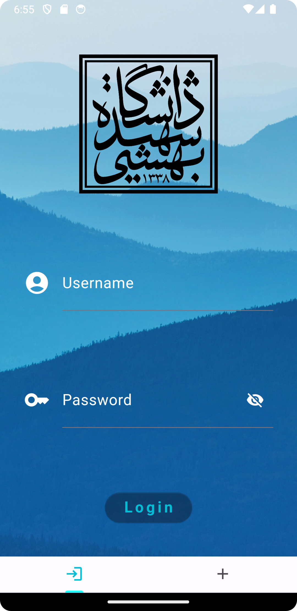
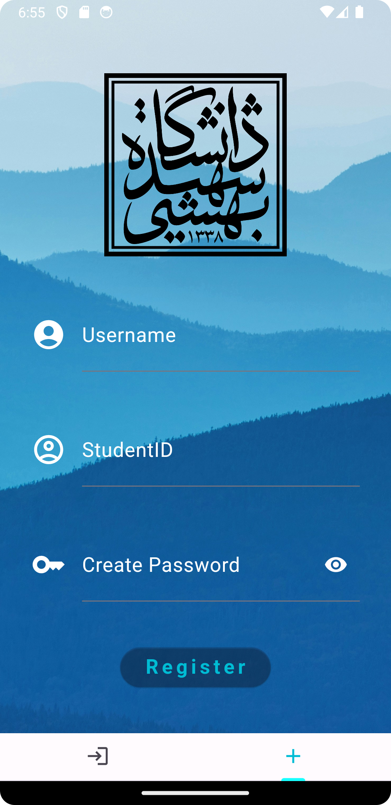
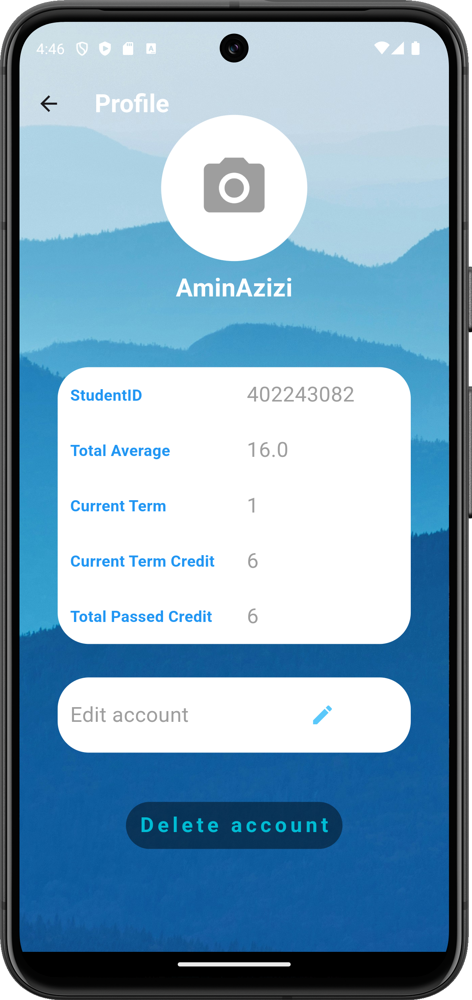
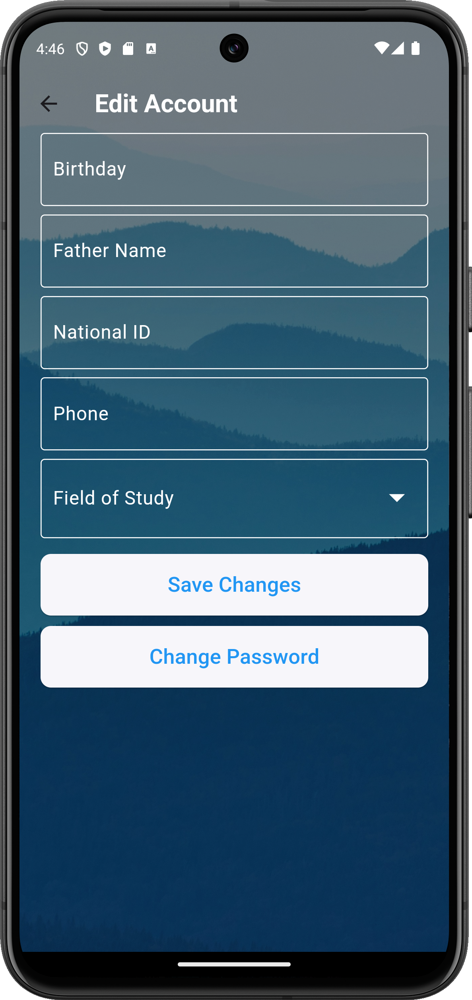

---

# University Management System (دانشجویار)

- This application was developed in spring 2024 (approximately 1403 in the Persian calendar).

## Description
This project is a comprehensive system for university management, providing features such as student and faculty management, viewing student academic statuses, registering for classes, viewing deadlines, and university news.

## Installation and Setup
To install and set up the project, follow these steps:
1. Make sure JDK and Android Studio are installed on your system.
2. Clone the source code:
   ```
   git clone https://github.com/AloofAli/danshjoyar-flutter.git
   ```
3. Open the project in Android Studio.
4. Run the project on the emulator or your physical device.

## Project Structure
The project consists of two main sections:
- **CLI**: The command-line interface section for university management using Java.
- **Application**: The mobile application section using the Flutter framework.

```
daneshjoyar_flutter/
├── lib/
│   ├── main.dart                
│   ├── DaneshjoyarApp.dart      
│   ├── pages/                   
│   │   ├── saraPage.dart            
│   │   ├── tamrina.dart        
│   │   ├── khabaraPage.dart         
│   │   ├── classaPage.dart         
│   │   └── karapage.dart
│   ├── NewsHandling/            
│   ├── asset/                 
│   ├── Main/                  
│   └── ...
```

## Usage
1. Sign up and log in as a student or faculty member.
2. View academic statuses, registered classes, deadlines, and university news.
3. As a faculty member, view the statuses of students in your classes and assign assignments or projects.

## Acknowledgements
This project utilizes some code and resources belonging to others. Please respect the appropriate permissions.

---

## Application Pages

### 1. Login and Sign Up

- **Description**: Users can log in to existing accounts or sign up for new accounts.
- **Functionality**: Handles authentication and manages user sessions.

---

### Overview of `LoginPage`


#### Imports
The `LoginPage` code imports necessary libraries and dependencies for Flutter UI design, networking, and toast notifications.

#### Class: `LoginPage`

**Stateful Widget**
- `LoginPage` manages the login page's state, handling user input and authentication.

**State Class: `_LoginPageState`**
- Manages visibility of password field (`_passwordVisible`) and login status (`userCanLogin`).

**Initialization (`initState()`)**
- Initializes `_passwordVisible` to `false` upon widget creation.

**Build Method (`build(BuildContext context)`)**
- Constructs UI layout using `Scaffold`, `Container`, background image, and university logo.
- Includes `TextField` widgets for username and password inputs, with password visibility toggle.
- Implements `ElevatedButton` for login, triggering `loginChecker` function upon press.

**Text Editing Controllers**
- Manages `usernameController` and `passwordController` for text inputs.

**Disposal (`dispose()`)**
- Frees up resources by disposing `usernameController` and `passwordController`.

**`loginChecker` Function (`Future<bool> loginChecker(String username, String password)`)**
- Connects to specified IP address (`172.28.0.1`) and port (`7777`), sends login request (`'LOGIN~$userData\u0000'`).
- Listens for server response, completes `Completer` based on success (`true`) or failure (`false`).

**`error` Function**
- Shows toast notification (`Toastification`) on login failure for invalid credentials.

### Usage
- `LoginPage` serves as entry point for university management app.
- Upon successful login, navigates users to `mainPageHandler` for further interaction.

### Additional Notes
- Assumes existence of server-side authentication (`loginChecker`).
- Provides user feedback through toast notifications for error handling.

---

### 2. Sign Up


#### Overview of `SignUpPage`

**Imports**
- Imports libraries for Flutter UI design, networking, and toast notifications.

**Stateful Widget: `SignUpPage`**
- Manages state for user registration, handling input and validation.

**State Class: `_SignUpPageState`**
- Manages visibility of password field (`_passwordVisible`), validation status (`_isValid`), and error messages (`_errorMessage`).

**Initialization (`initState()`)**
- Initializes `_passwordVisible` to `false` upon widget creation.

**Build Method (`build(BuildContext context)`)**
- Constructs UI layout using `Scaffold`, `Container`, background image, and university logo.
- Includes `TextFormField` widgets for username, student ID, and password inputs, with password visibility toggle.
- Implements `ElevatedButton` for registration, triggering `signupChecker` function upon press after password validation.

**Text Editing Controllers**
- Manages `usernameController`, `studentIDController`, and `passwordController` for text inputs.

**Disposal (`dispose()`)**
- Frees up resources by disposing text editing controllers.

**`_validatePassword` Function (`bool _validatePassword(String password)`)**
- Validates password criteria (length, uppercase, lowercase, digit, special character).
- Shows error messages through `error()` function for validation failures.

**`error` Function**
- Shows toast notification (`Toastification`) for password validation failure.

**`error_username_signup` Function**
- Shows toast notification (`Toastification`) for duplicate username or student ID during signup.

**`signupChecker` Function (`Future<bool> signupChecker(String username, String studentID, String password)`)**
- Connects to specified IP address (`172.28.0.1`) and port (`7777`), sends signup request (`'SIGNUP~$userData\u0000'`).
- Listens for server response, completes `Completer` based on success (`true`) or failure (`false`).

#### Usage
- `SignUpPage` allows new users to register for university management app.
- Upon successful registration, navigates users to `mainPageHandler` for further interaction.

#### Additional Notes
- Assumes existence of server-side registration (`signupChecker`).
- Provides user-friendly error handling through toast notifications (`error()` and `error_username_signup()`).

---

### 3. User Profile

#### `profileScreen` Class

**Class Structure and Imports**
- Imports essential libraries for Flutter UI design and functionality.
- Defines `profileScreen` as stateful widget managing user profile information.

**State Management (`_profileScreenState`)**
- Initializes user data using `initDatas()` upon widget creation.
- Manages UI with `Scaffold`, `AppBar`, `Stack`, `SingleChildScrollView`, and various layout widgets.
- Displays `username`, `studentID`, `totalAverage`, `currentTerm`, `currentTermCredit`, and `totalPassedCredit` fetched from server using `initDatas()`.

**Networking (`initDatas()` and `deleteAccount()` Methods)**
- Connects to server to fetch user profile data (`PROFILE~$userData\u0000`).
- Deletes user account on confirmation via `DELETEACCOUNT~$un\u0000`.

**UI Elements and Styling**
- Utilizes `MediaQuery` for responsive design, `Container` and `BoxDecoration` for styling.
- Implements interactive elements (`CircleAvatar`, `Text`, `IconButton`, `TextButton`, `AlertDialog`) for profile management.

**Usage**
- Centralizes user profile management within university app.
- Provides features for updating profile picture, academic details, and account settings.

---

### 4. Edit Account


#### `EditAccount` Class

**Class Structure and Imports**
- Imports libraries for Flutter UI design and application functionality.
- Defines `EditAccount` as stateful widget for editing user account details.

**State Management (`_EditAccountState`)**
- Manages UI with `Scaffold`, transparent app bar, background image, and form fields (`TextField`, `DropdownButtonFormField`).
- Allows users to edit account details (`Birthday`, `Father Name`, `National ID`, `Phone`, `Field of Study`).

**Networking (`editAccount()` Method)**
- Sends edited account details to server (`EDITACCOUNT~$userData\u0000`).
- Shows snackbar feedback on success or failure based on server response.

**Usage**
- Provides user-friendly interface for modifying account information.
- Ensures seamless interaction within university management app.

---

### 5. Change Password


#### `ChangePasswordPage` Class

**Class Structure and Imports**
- Imports libraries for Flutter UI design and toast notifications.
- Defines `ChangePasswordPage` as stateful widget for changing user password.

**State Management (`_ChangePasswordPageState`)**
- Manages UI with `Scaffold`, transparent app bar, background image, and form fields (`TextField`).
- Validates `Current Password`, `New Password`, and `Confirm New Password` inputs.
- Shows snackbar feedback for validation errors (`toastification`).

**Networking (`currentPasswordChecker()` and `changePassword()` Methods)**
- Verifies current password (`CURRENTPASSWORD~$currentPassword\u0000`).
- Changes user password (`CHANGEPASSWORD~$newPassword\u0000`).

**Usage**
- Provides secure interface for changing user password.
- Implements validation and feedback mechanisms within university management app.

---

### 6. Home Page (`sara`)


#### `sara` Class

**Class Structure and Imports**
- Imports necessary libraries for Dart and Flutter UI design

.
- Defines `sara` as stateful widget managing home page functionality.

**State Management (`_saraState`)**
- Initializes UI with `Scaffold`, app bar, and background image.
- Manages `PageController` for navigating through `News`, `Announcements`, `Classes`, `Assignments`, and `Profile`.

**Networking (`khabara` and `classa` Methods)**
- Connects to server to fetch `News` and `Announcements` data (`NEWS~$userID\u0000`).
- Retrieves `Classes` and `Assignments` details from server (`CLASSES~$userID\u0000`).

**Usage**
- Centralizes main navigation within university app.
- Provides quick access to `News`, `Announcements`, `Classes`, `Assignments`, and `Profile`.

---

### 7. Classes Page (`classa`)


#### `classa` Class

**Class Structure and Imports**
- Imports essential libraries for Flutter UI design and networking.
- Defines `classa` as stateful widget for managing class enrollment.

**State Management (`_classaState`)**
- Manages UI with `Scaffold`, app bar, and background image.
- Displays `registeredClasses` using `ListView.builder` and `Card` widgets.
- Implements `FloatingActionButton` for adding new classes.

**Networking (`classa` Method)**
- Retrieves `registeredClasses` from server (`CLASSES~$userData\u0000`).
- Adds new classes to server (`ADDCLASS~$classData\u0000`).

**Usage**
- Facilitates class management within university app.
- Enables users to view enrolled classes and add new classes.

---

### 8. News Page (`khabara`)


#### `khabara` Class

**Class Structure and Imports**
- Imports libraries for Flutter UI design and networking.
- Defines `khabara` as stateful widget for managing news and announcements.

**State Management (`_khabaraState`)**
- Manages UI with `Scaffold`, app bar, and background image.
- Displays `newsArticles` using `ListView.builder` and `Card` widgets.
- Implements `RefreshIndicator` for updating news feed.

**Networking (`khabara` Method)**
- Retrieves `newsArticles` from server (`NEWS~$userData\u0000`).

**Usage**
- Centralizes news and announcements within university app.
- Enables users to stay informed about university updates and events.

---

### 9. Assignments Page (`tamrina`)


#### `tamrina` Class

**Class Structure and Imports**
- Imports libraries for Flutter UI design and networking.
- Defines `tamrina` as stateful widget for managing assignments.

**State Management (`_tamrinaState`)**
- Manages UI with `Scaffold`, app bar, and background image.
- Displays `assignmentsList` using `ListView.builder` and `Card` widgets.
- Implements `FloatingActionButton` for uploading new assignments.

**Networking (`tamrina` Method)**
- Retrieves `assignmentsList` from server (`ASSIGNMENTS~$userData\u0000`).
- Uploads new assignments to server (`UPLOAD~$assignmentData\u0000`).

**Usage**
- Facilitates assignment management within university app.
- Enables users to view, submit, and manage assignments.

---

### 10. To-Do List Page (`kara`)


#### `kara` Class

**Class Structure and Imports**
- Imports necessary libraries for Dart and Flutter UI design.
- Defines `kara` as stateful widget for managing tasks and to-do lists.

**State Management (`_karaState`)**
- Initializes UI with `Scaffold`, app bar, and background image.
- Manages `tasksList` using `ListView.builder` and `CheckboxListTile` widgets.
- Implements `FloatingActionButton` for adding new tasks.

**Networking (`kara` Method)**
- Retrieves `tasksList` from server (`TASKS~$userData\u0000`).
- Adds new tasks to server (`ADDTASK~$taskData\u0000`).

**Usage**
- Centralizes task and to-do list management within university app.
- Enables users to create, update, and delete tasks.

---

## Conclusion

The University Management System (دانشجویار) project provides a comprehensive platform for managing university operations, including student and faculty management, course registration, assignment management, news updates, and user profiles. Utilizing the Flutter framework ensures a modern and seamless user experience across platforms, enhancing productivity and engagement within the university community.

---
